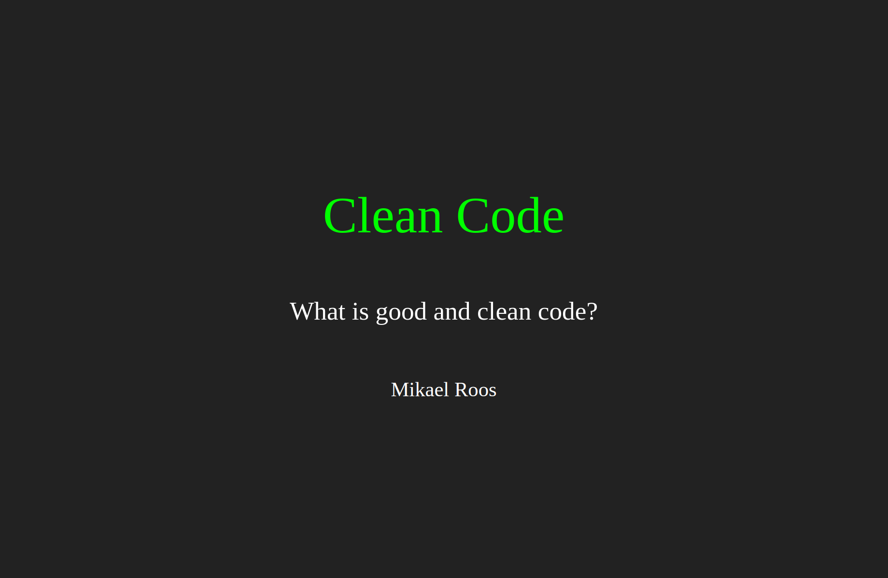

Introduction to testing and clean code
====================

This is an introduction to unit testing and the concept of clean code.

You can browse [the HTML slides used in the presentation](https://mikael-roos.gitlab.io/oopython/lecture/intro-testing-clean-code/slide.html) (press f/esc to enter/exit full screen mode and navigate using the arrows).

<!--
Recorded presentation, 44 minutes long (Swedish).

-->

Resources
------------------------

Resources that are used, or are relevant, for the areas that the lecture covers.

1. Review a few of [the most common software philosophies](https://en.wikipedia.org/wiki/List_of_software_development_philosophies).

<!--
Some basic reading instruction on clean code?
-->
